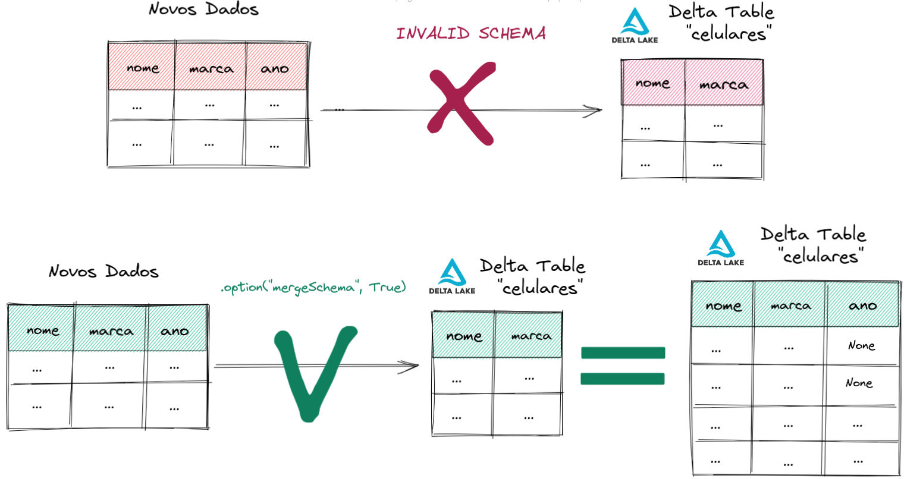

# Medium - Delta

- Repositório com arquivos dos artigos Medium sobre Delta Lake.

- [Artigo 1: O que são Delta Lake Constraints?](https://medium.com/@thiagoheron/delta-lake-constraints-8a2e7290551e)

- [Artigo 2: O que é Schema Enforcement, Schema Evolution e Merge Schema? Como utilizar na prática?](https://medium.com/@thiagoheron/o-que-%C3%A9-schema-enforcement-schema-evolution-e-merge-schema-como-utilizar-na-pr%C3%A1tica-63db11abd4b9)

- [Artigo 3: O que é Data Deduplication? Upsert? Como lidar na prática?](https://medium.com/@thiagoheron/delta-o-que-%C3%A9-data-deduplication-upsert-como-lidar-na-pr%C3%A1tica-b3957f9f82e1)

  

### Medium: [Delta] O que são Delta Lake Constraints?

- [O que são Delta Lake Constraints?](https://medium.com/@thiagoheron/delta-lake-constraints-8a2e7290551e)

  

### Medium: [Delta] O que é Schema Enforcement, Schema Evolution e Merge Schema? Como utilizar na prática?

- [O que é Schema Enforcement, Schema Evolution e Merge Schema? Como utilizar na prática?](https://medium.com/@thiagoheron/o-que-%C3%A9-schema-enforcement-schema-evolution-e-merge-schema-como-utilizar-na-pr%C3%A1tica-63db11abd4b9)

    
  

### Medium: [Delta] O que é Data Deduplication? Upsert? Como lidar na prática?

- [O que é Data Deduplication? Upsert? Como lidar na prática?](https://medium.com/@thiagoheron/delta-o-que-%C3%A9-data-deduplication-upsert-como-lidar-na-pr%C3%A1tica-b3957f9f82e1)

